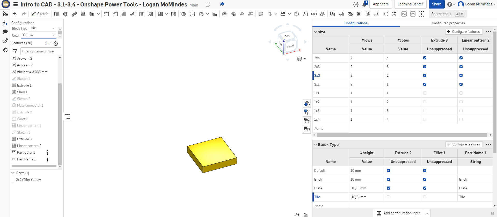
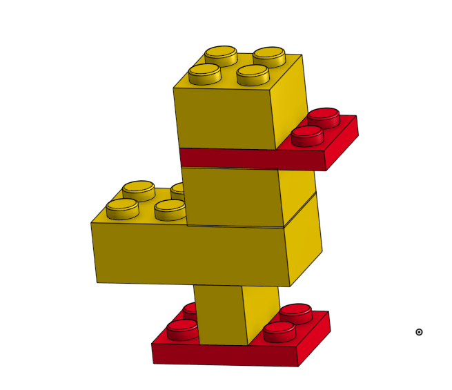
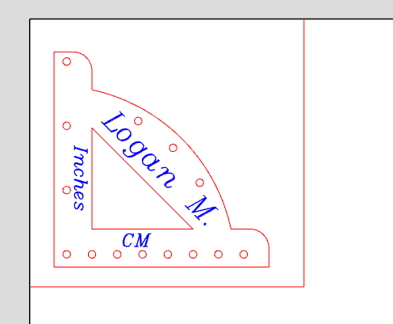
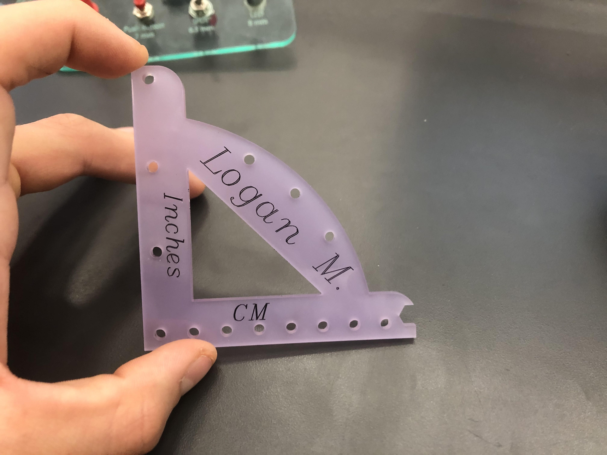

# AdvancedCAD
## Skateboard 

Create a skateboard, and all the parts required to make it, in OnShape by following the given directions.

 [Skateboard in Onshape](https://cvilleschools.onshape.com/documents/5dd951d5ef2426783ad6a0fb/w/c136a19b89cf6a090f1fc244/e/7c48be8f672c3db963985413?renderMode=0&uiState=618d316f846b426cb8270039)

##### Board Reflection

Following the instructions along with the gif showing you what to do makes crafting the parts pretty easy but slightly tedious The split tool allowed me to make a singular line cut and split the part in two. The other main thing that i was taught in this assignment was the move face tool. The move face tool is not very complicated at all and is really just a transfrom tool but shifting a face in a different direction, which is really nice to have.

#### Deck

Making the deck was super easy because it was just extruding a sketch of a rectangle and a cirle on each end to make a rounded edge. Using the split tool to seperate a part into differnet peices is a handy tool. 

#### Trucks

#### Wheel and Bearing

This was not difficult. It gave me a refresher on dimensioning a sketch over a centerline to easily label the diameter of of a future revolve. 

#### Skateboard 

Fastening the trucks to the board and adding screwsto the holes was simple. Revolve mates were required to attach the to wheels to the trucks so they could spin the right way.

## Brick

 [Brick in Onshape](https://cvilleschools.onshape.com/documents/8c72551a77111bee520458c7/w/4ac99fc8dde052bfbcc8316d/e/57ee1fc9eac4c6c5c466c045?configuration=List_SwXPmVXyAXGZJ1%3DB%3BList_XPcLdCBoIWrw8x%3DBlock%3BList_goXkIErly0BeVz%3D_1x4&renderMode=0&uiState=618d31417d00ae10b43e2c90)

### How the Pros Do it: Making lego

Variables are critical to use so that we are able to make differnet configurations with the height, rows, and collums of the lego. The shell tool was usefull to "shell" out the inside of the brick to the prefered surface. 

### One Brick to Rule Them All: Configurations 

We use configurations to make 3 different versions. We have Brick, Plate, and Tile; which change the height and the studs. We have a configuration that changes the number of rows and columns so we can make any size brick. Lastly, we have a configuration to change the color. This was done through a custom feature. We also used a custom feature to change the name of the part based on the brick type, size, and color. This will be helpful in an assembly. 

###  Building Blocks: Duck 

In parts assembly, I used "snap mode" to easily snap together different types of bricks to make a duck. I merely had to drag the mate connecter to the desired area and rotate (q) the block to the right position.

## Multi-Tool

Make an acrylic Multi-Tool with many differnet uses. 
 [Multi-Tool in Onshape](https://cvilleschools.onshape.com/documents/d2a8c3aafd68b394ccfac519/w/ff6f706d2c0a54b23bfbb45f/e/d900245b5d8e715c0517d839?renderMode=0&uiState=618d30e1ec512e26d94c557b)

### 1

This Multi-Tool has 3 mm circles either spaced 10 mm or 1 inch apart. There are also circles at 30, 45, and 60 degrees from the bottom edge. All the circles are 5 mm from the edge of the tool. It is a "multi" tool because we can use it for many different measurements or angles. 

### 2

In this step, we put our part into a drawing tab. I put the top face down with a 1:1 ratio and added red lines around the perimeter to make a complete cut. The text tool allows us to etch (blue) text into our part when we laser cut it. This is the link to the [Engineering Shared File](https://drive.google.com/drive/folders/1LP1VsT4ttmdsJTHsufIzDFmNmcQPOAwn) for laser cutting.

### 3

In an Assembly, I instered a #4-40 nut. I "edited in context" which allowed me to go into the part studio with the nut. I took the perimeter of the niut and cut it from the tool to make a wrech. Updating the drawing was easy as pie. 
