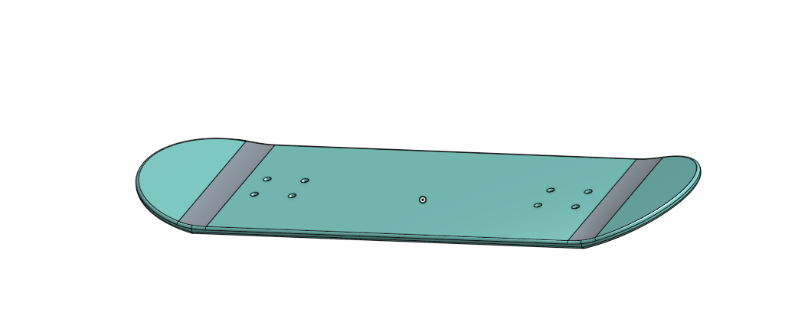
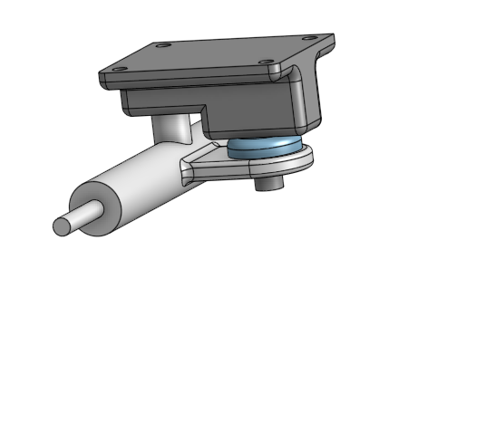
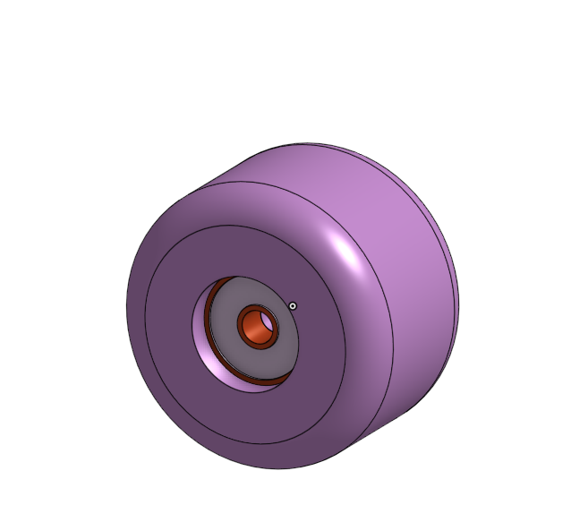

# AdvancedCAD
## Skateboard 
### Assginment
Create a skateboard, and all the parts required to make it, in OnShape by following the given directions.
#### Skateboard 

##### Board Reflection
Following the instructions along with the gif showing you what to do makes crafting the parts pretty easy but slightly tedious The split tool allowed me to make a singular line cut and split the part in two. The other main thing that i was taught in this assignment was the move face tool. The move face tool is not very complicated at all and is really just a transfrom tool but shifting a face in a different direction, which is really nice to have.
#### Deck

Making the deck was super easy because it was just extruding a sketch of a rectangle and a cirle on each end to make a rounded edge. Using the split tool to seperate a part into differnet peices is a handy tool. 
#### Trucks

#### Wheel and Bearing

This was not difficult. It gave me a refresher on dimensioning a sketch over a centerline to easily label the diameter of of a future revolve. 
